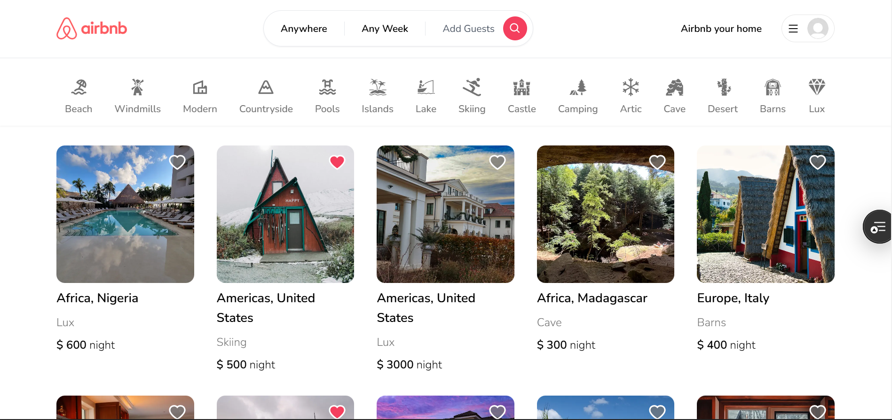

# My Airbnb Clone

A fully functional Airbnb clone built with the Next.js 14 App Router. This project includes features like property listings, reservations, favorites, and a robust authentication system.



## 🌟 Features

- **Authentication**: Secure login/signup using Google, GitHub, and email/password (Next-Auth v5).
- **Property Management**: Create, edit, and delete property listings with image uploads (Cloudinary).
- **Booking System**: Reserve properties for specific dates with real-time availability.
- **Favorites**: Save and manage your favorite properties.
- **Search & Filter**: Advanced search by location, date range, and category.
- **Interactive Maps**: View property locations using Leaflet.
- **Responsive Design**: Fully responsive UI built with Tailwind CSS.

## 🛠️ Tech Stack

- **Framework**: [Next.js 14 (App Router)](https://nextjs.org/)
- **Language**: [TypeScript](https://www.typescriptlang.org/)
- **Styling**: [Tailwind CSS](https://tailwindcss.com/)
- **Database**: [MongoDB](https://www.mongodb.com/)
- **ORM**: [Prisma](https://www.prisma.io/)
- **Authentication**: [NextAuth.js v5](https://next-auth.js.org/)
- **State Management**: [Zustand](https://zustand-demo.pmnd.rs/)
- **Image Hosting**: [Cloudinary](https://cloudinary.com/)
- **Forms**: [React Hook Form](https://react-hook-form.com/) & [Zod](https://zod.dev/)

## 📋 Requirements

- Node.js 18.x or later
- MongoDB database (local or Atlas)
- Cloudinary account for image uploads
- Google and GitHub Developer accounts (for OAuth)

## 🚀 Getting Started

### 1. Clone the repository
```bash
git clone https://github.com/your-username/my-airbnb-clone.git
cd my-airbnb-clone
```

### 2. Install dependencies
```bash
npm install
```

### 3. Set up Environment Variables
Create a `.env` file in the root directory and add the following:

```env
# Database
DATABASE_URL="mongodb+srv://..."

# Next Auth
NEXTAUTH_SECRET="your-next-auth-secret"
# NEXT_PUBLIC_AUTH_URL="http://localhost:3000" # Optional for local dev

# OAuth Providers
GOOGLE_CLIENT_ID="your-google-client-id"
GOOGLE_CLIENT_SECRET="your-google-client-secret"
GITHUB_ID="your-github-client-id"
GITHUB_SECRET="your-github-secret"

# Cloudinary
NEXT_PUBLIC_CLOUDINARY_CLOUD_NAME="your-cloudinary-cloud-name"
```

### 4. Prisma Setup
Generate the Prisma client and push the schema to your database:

```bash
npx prisma generate
npx prisma db push
```

### 5. Run the application
```bash
npm run dev
```

Open [http://localhost:3000](http://localhost:3000) with your browser to see the result.

## 📜 Available Scripts

- `npm run dev`: Starts the development server.
- `npm run build`: Builds the application for production.
- `npm run start`: Starts the production server.
- `npm run lint`: Runs ESLint to check for code quality issues.
- `postinstall`: Automatically runs `prisma generate` after dependency installation.

## 📂 Project Structure

```text
├── app/               # Next.js App Router (pages, layouts, components)
│   ├── actions/       # Server Actions for data fetching and mutations
│   ├── api/           # API routes (including NextAuth)
│   ├── components/    # Reusable UI components
│   ├── hooks/         # Custom React hooks
│   ├── libs/          # Shared libraries (Prisma, etc.)
│   └── types/         # TypeScript interfaces and types
├── prisma/            # Prisma schema and database configuration
├── public/            # Static assets (images, icons)
├── middleware.ts      # Next.js middleware for route protection
└── package.json       # Project dependencies and scripts
```